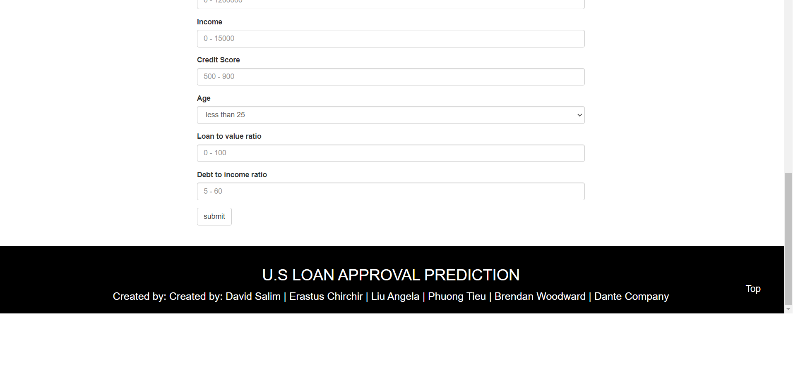
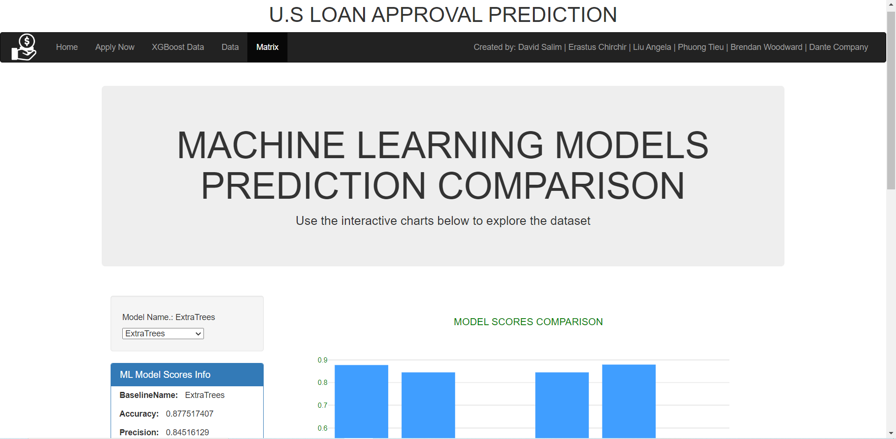
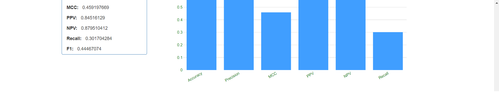
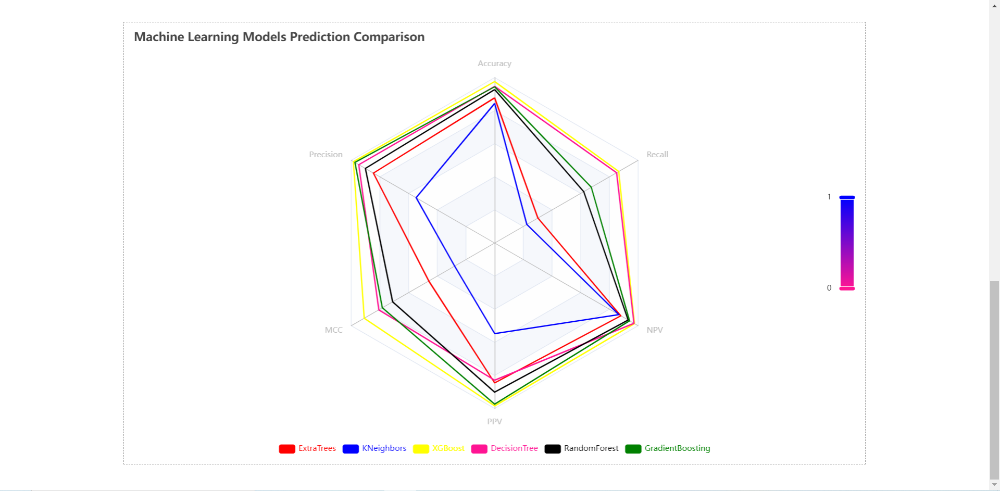

# Loan Application Assessment

## Group Member

Group 1 - David, Angela, Phuong, Brendan, Erastus, Dante

## Objective

To create a machine learning model capable of assessing whether a loan application will be successful based on the applicants’ circumstances, including income, loan amount, credit score and property value.   

## Dataset Selection

Our approach is to look for dataset that contains large samples and is roughly normally distributed overall. The dataset used was sourced from American Bank loan application data, showing who was approved for loans based on their various situations, which was gathered from the following web address.

https://www.kaggle.com/datasets/yasserh/loan-default-dataset/code

## Methodology

* Data Preprocessing 

We selected features (columns) for our model based on our knowledge and experience (refer to Appendix 1 for ERD with the list of selected features). Rows that had more than 3 null values were removed. The remaining categorical value data was converted to numerical value using label encoder. KNNimputer was used to fill in the missing values. Once preprocessed, the data was stored in an SQLite Database.

To train our model, the preprocessed data was split into train and test data and normalized using standard scaler. 

* Model Development 

The Machine Leaning Algorithms tested were Extra Trees, KNeighbours, XGBoost, Decision Tree, Random Forest and Gradient Boosting. Grid search is used for hyperparameter tuning to maximise the algorithms’ performance. The performance result of each algorithm is included in our project report and notebook.

* User Interface

A HTML website was created to display our final product, which is a loan application form that will provide application result under 60 seconds after submitted. The form uses XGBoost algorithm to produce the result. In addition, graphs displaying various machine learning algorithm performances along with data comparisons are included on the website. Echart.js, Jquery.js and Seaborn are used to develop the graphs.

## Conclusion 

Selecting dataset with the right sample size, data engineering and machine learning algorithm selection are critical steps in developing a high performing model. Various Machine Learning Algorithms were tested to determine which algorithm performs the best given the dataset collected. In our case, XGBoost was the best algorithm to use so was selected for our loan application form in our website. 

## Application Screenshots

### Application form

### Machine Learning Models Performance Comparison

